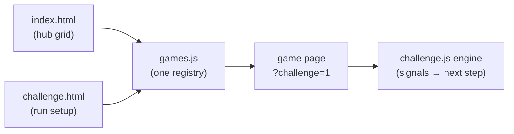

<p align="center">
  
</p>

<h1 align="center">Brain Wars</h1>

<p align="center">
  <em>Math practice for children: ten games, a challenge mode, three languages, and offline play.</em>
</p>

<p align="center">
  <a href="https://alex-just.github.io/brain-wars/"></a>
  
  
  
</p>

Brain Wars is a set of small math games for primary-school children. The app is plain HTML, CSS, and JavaScript. It has no `package.json` and no accounts. A service worker stores the pages on the first visit, so the app installs on a home screen and works offline. The languages are English, Spanish, and Russian. A new device starts in Spanish.

**Play it now → <https://alex-just.github.io/brain-wars/>**

## Games

| Game | What it does |
| --- | --- |
| **Challenge** | A mixed run of 1–50 games at one difficulty from 1 to 20. Each game type appears once before any repeat. A mistake sends that game to the end of the queue. The results screen awards up to three stars. |
| **Follow the Leader** | Watch squares light up, then tap them in the same order. The sequence grows and speeds up. |
| **Unfollow the Leader** | The same game in reverse: tap the last square first. |
| **Mental Math** | Choose the missing operator (`+`, `−`, `×`, `÷`). |
| **What Time Is It?** | Read an analog clock and pick the matching time. |
| **Long Division** | Divide in the Russian bracket layout: quotient digit, product, remainder, bring down. |
| **Long Multiplication** | Multiply in columns, with carries and partial products. |
| **Long Addition** | Add in columns, with carries. |
| **Long Subtraction** | Subtract in columns, with borrowing. |
| **Money Problems** | Euro word problems: add the purchases and find the change. |
| **Elapsed Time** | Find the end time, the start time, or the duration. Type hours and minutes. Story problems start at level 7. |
| **Time Calculations** | Add and subtract hours and minutes in columns. Sixty minutes make one hour. |
| **Money Calculations** | Add and subtract euros and cents in columns. One hundred cents make one euro. |

Follow the Leader and Unfollow the Leader stay in the repository. The hub and Challenge mode omit them. Open those pages by URL.

## Features

- **Offline app.** The service worker precaches the pages, scripts, and icons. The app installs on a home screen. An unknown page opened offline falls back to the hub.
- **Three languages.** English, Spanish, and Russian share one set of keys. Every page has a language toggle. The choice stays on the device, including in Challenge mode.
- **Levels.** Eight games offer 20 levels. Mental Math and What Time Is It? raise the difficulty during play. Challenge mode uses one difficulty for the whole run.
- **Typed numbers.** The four column games accept numbers you type, including decimals. A result can have up to eight digits.
- **Large targets.** The layout respects the phone safe area and `prefers-reduced-motion`. Controls have ARIA labels.

## Analytics

The live app sends one row per answer attempt to its own Cloudflare Worker. The row stores the game, the result (`1` right or `0` wrong), the device time, a random device id, and the request IP and country. The worker clears the IP after 90 days. The other columns stay. The app sets no cookies and creates no accounts.

Telling-time stores a wrong tap and skips the completion that follows that same tap. Every other game stores the wrong attempt and the solved attempt as two rows.

Read the rows in the [D1 console](https://dash.cloudflare.com/05e38f321dad15a6144629ca4dbb5fc7/workers/d1/databases/dde0c3a3-95c0-490d-800b-7ed9debd4197). Deploy steps, limits, and queries are in [`analytics-worker/README.md`](analytics-worker/README.md).

Capture runs when `ENDPOINT` in `analytics.js` is set. This repository points it at the live ingest URL.

## Getting started

Clone the repository and start a static server:

```bash
git clone https://github.com/Alex-Just/brain-wars.git
cd brain-wars
python3 -m http.server 8000
```

Open <http://localhost:8000>.

`index.html` also opens from disk for play. The service worker needs `http://` or `https://`.

## Tests

```bash
node test-i18n.js      # translations, pages, registry, challenge queue, question generators
node test-sw.js        # manifest, page wiring, service worker precache
node test-analytics.js # analytics client and worker
```

These scripts use Node's standard library only.

## Project structure

```text
brain-wars/
├── index.html            # Hub: renders the game grid from games.js
├── challenge.html        # Challenge setup and results
├── challenge.js          # Challenge run model and the engine on game pages
├── games.js              # Game registry: pages, levels, signals, icons
├── analytics.js          # Captures attempts, queues them, and sends them
├── i18n.js               # EN / ES / RU text, language toggle, number format
├── elapsed-time.js       # Elapsed-time questions, shared with the tests
├── time-calculations.js  # Time add and subtract problems, shared with the tests
├── money-calculations.js # Money add and subtract problems, shared with the tests
├── *.html                # One page per game: follow-the-leader, unfollow-the-leader,
│                         #   operations, telling-time-es, long-division,
│                         #   long-multiplication, long-addition, long-subtraction,
│                         #   money-problems, elapsed-time, time-calculations,
│                         #   money-calculations
├── pwa.js                # Registers the service worker on http and https
├── sw.js                 # Precache and fetch rules. VERSION is v7
├── manifest.json         # PWA name and icons
├── icons/                # App icons
├── analytics-worker/     # Worker, D1 schema, and Wrangler config
├── test-i18n.js          # Node tests for pages, text, and generators
├── test-sw.js            # Node tests for the service worker
├── test-analytics.js     # Node tests for the client and the worker
└── clock/, transformers-logo.svg   # Spare artwork
```

## How it works



**Registry.** `games.js` is the list of games. The hub draws its tiles from that list. Challenge mode builds its queue from the same list. `picker` means the page has a level menu. `startup` means the page reads the challenge level when a round starts. Each game names the DOM signal for a finished round and the signal for a mistake.

**Challenge.** `challenge.js` saves the run for `challenge.html`. The same file runs inside a game opened with `?challenge=1`. It draws the progress bar, pins the level, and reads the game signals four times a second. Each step replaces the history entry, so Back returns to the hub. A solved game that had mistakes returns later in the queue and marks the run with ⚠. The results screen awards 1–3 stars.

**Languages.** `i18n.js` holds three dictionaries with the same keys. A new device starts in Spanish. The chosen language stays in `localStorage`.

**Offline.** `sw.js` precaches the app on install and deletes old caches on activate. A page load uses the network, then the cache, then the hub. Other files come from the cache and refresh in the background. A new worker takes over when its precache is ready, and the open page reloads once. Bump `VERSION` when you change the precache list.

## Deploy

GitHub Pages publishes the repository root from `master` to <https://alex-just.github.io/brain-wars/>. Any static host works the same way. There is no build command.

The answers worker deploys separately. See [`analytics-worker/README.md`](analytics-worker/README.md).

## Add a game

1. Create `<game>.html`. Copy the shared head (manifest, icons, `pwa.js`), the back arrow, and the language toggle. Load the scripts in this order: `i18n.js`, `games.js`, `analytics.js`, the game script, `challenge.js`.
2. Add the game to `games.js`: `id`, `file`, `titleKey`, level mode (`picker` or `startup`), completion signal, mistake signal, and hub icon.
3. Add the new keys to all three dictionaries in `i18n.js`.
4. Add the page to `PRECACHE` in `sw.js` and bump `VERSION`.
5. Add the page to `INTEGRATED_PAGES` in `test-i18n.js` and update the page count in `test-sw.js`.
6. Run `node test-i18n.js && node test-sw.js && node test-analytics.js`, then play one round.

---

Report bugs and ideas in the [issues](https://github.com/Alex-Just/brain-wars/issues).
