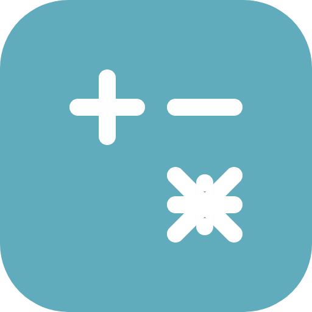
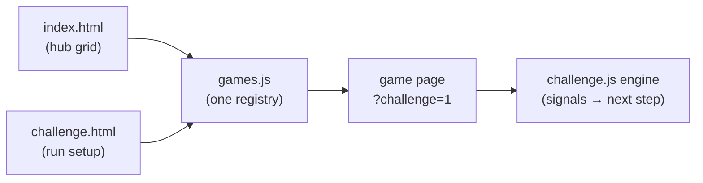

<p align="center">
  
</p>

<h1 align="center">Brain Wars</h1>

<p align="center">
  <em>Playful math practice for kids: a challenge mode plus ten games, three languages, and offline play.</em>
</p>

<p align="center">
  <a href="https://alex-just.github.io/brain-wars/"></a>
  
  
  
</p>

Brain Wars is a collection of small, playful math games for primary-school children. The whole app is plain HTML, CSS and JavaScript — no frameworks, no build step, no accounts, no trackers. A service worker caches every page on the first visit, so it installs like an app and keeps working offline, and the interface comes in **English, Spanish and Russian**.

**Play it now → <https://alex-just.github.io/brain-wars/>**

## Games

| Game | What it is |
| --- | --- |
| **Challenge** | A mixed run: pick 1–50 games and a difficulty (1–20). Every game type is dealt once before any repeats, and mistakes bring that game back later. A progress bar tracks the run, and the results screen awards up to three stars. |
| **Follow the Leader** | Watch a sequence of squares light up, then repeat it. The sequence grows and speeds up as you climb. |
| **Unfollow the Leader** | Follow the Leader in pink, played backwards: the last square shown is the first one to tap. |
| **Mental Math** | Choose the missing operator (+, −, ×, ÷) that makes the equation true. |
| **What Time Is It?** | Read an analog clock and pick the matching time. |
| **Long Division** | Divide step by step in the Russian bracket layout — quotient digit, product, remainder, bring down. |
| **Long Multiplication** | Multiply in columns, digit by digit, including carries and partial products. |
| **Long Addition** | Add in columns, including carries. |
| **Long Subtraction** | Subtract in columns, including borrowing. |
| **Money Problems** | Euro word problems: add up purchases and work out the change. |
| **Elapsed Time** | Find the end time, the start time, or how long something took; type hours and minutes like a digital clock. Story problems join in from level 7. |

## Features

- **Offline-first PWA.** The service worker precaches every page, script and icon, so the app installs to a home screen and plays with no connection; offline navigations fall back to the hub.
- **Three languages, one code path.** EN / ES / RU dictionaries with identical key sets (the tests enforce it), a flag toggle on every page and locale-aware number formatting. The first visit starts in Russian, and your choice is remembered. In Challenge mode every step can appear in a different language — or pin one and it sticks for the run.
- **Levels that fit the child.** Six games offer a menu of 20 levels; the other four ramp difficulty automatically; Challenge mode pins one difficulty across the whole run.
- **Custom equations.** All four column-arithmetic games accept numbers you type in — whole numbers or decimals, results up to eight digits.
- **Kid-friendly and accessible.** Large touch targets, safe-area padding for notched phones, `prefers-reduced-motion` support, ARIA labels and live regions.
- **Tested without a framework.** Plain Node.js scripts validate the translations, page wiring, game registry, challenge queue, question generators and service worker precache.

## Getting started

There is nothing to build and nothing to install — not even a `package.json`:

```bash
git clone https://github.com/Alex-Just/brain-wars.git
cd brain-wars
python3 -m http.server 8000
```

Then open <http://localhost:8000>.

Opening `index.html` straight from disk also works for playing; service workers need a secure context, so use a local server (or any HTTPS host) to try installation and offline mode.

## Tests

```bash
node test-i18n.js   # translations, pages, registry, challenge queue, question generators
node test-sw.js     # manifest, page wiring, service worker precache
```

Both scripts use only Node's standard library, so no `npm install` is needed.

## Project structure

```text
brain-wars/
├── index.html            # Hub: renders the game grid from games.js
├── challenge.html        # Challenge setup and results screen
├── challenge.js          # Challenge run model + engine injected into game pages
├── games.js              # The single game registry: pages, level modes, signals, icons
├── i18n.js               # EN / ES / RU dictionaries, language toggle, number formatting
├── elapsed-time.js       # Elapsed-time question generator (shared with the tests)
├── *.html                # One self-contained page per game (markup, styles and logic
│                         #   together): follow-the-leader, unfollow-the-leader, operations,
│                         #   telling-time-es, long-division, long-multiplication,
│                         #   long-addition, long-subtraction, money-problems, elapsed-time
├── pwa.js                # Registers the service worker on secure contexts
├── sw.js                 # Offline-first service worker (precache + fetch strategies)
├── manifest.json         # PWA metadata and icons
├── icons/                # App and home-screen icons
├── test-i18n.js          # Node tests described above
├── test-sw.js            # Node tests described above
├── docs/superpowers/     # Design spec and plan for the PWA work
└── clock/, transformers-logo.svg   # Unused early artwork
```

## How it works



**One registry.** `games.js` is the single list of games. The hub renders its tiles from it, Challenge mode deals its queue from it, and both test files verify pages and precache against it. Each entry declares how a game takes a level (`picker` — the page has its own level menu; `startup` — the page reads the challenge level while starting a round) and how to spot a finished round or a mistake through simple DOM signals (`class`, `style` or localized `text` on a selector).

**Challenge mode.** `challenge.js` plays two roles: the run model used by `challenge.html` (queue and progress saved in `localStorage`, so an interrupted run can continue), and an engine injected into any game opened with `?challenge=1`. The engine draws the top progress bar, pins the level, polls the game's completion and mistake signals four times a second, and moves the player to the next step. Every step replaces the current history entry, so the back button always exits to the hub instead of replaying an earlier round. Games solved with mistakes come back later in the queue and mark the run with a ⚠; the results screen awards 1–3 stars based on retries.

**Translations.** `i18n.js` holds three dictionaries with identical key sets, a `data-i18n` attribute pass, `I18n.t()` interpolation, a per-language decimal separator, and a language toggle that every page mounts. The choice is remembered in `localStorage`; Challenge mode either rotates languages between steps or pins a chosen one.

**Offline.** `sw.js` precaches the whole app on install and cleans old caches on activate. Navigations use network-first (fresh when online; cached page, then hub fallback, when offline), while everything else is stale-while-revalidate. Precache and runtime fetches bypass or revalidate the browser's HTTP cache, a new worker takes over as soon as its fresh precache is ready, and the open page reloads once onto it — so installed copies update on the next launch. Bump `VERSION` when the precache list changes; content edits to listed files refresh by themselves.

## Deploying

The app is plain static files, so GitHub Pages publishes the repository root from `master` to <https://alex-just.github.io/brain-wars/>. Any static host (Netlify, Cloudflare Pages, S3, a Raspberry Pi…) works the same way — there is no build command.

## Adding a game

The registry, the tests and the service worker exist to keep new pages consistent. To add a game:

1. Create `<game>.html` as a self-contained page, copying the shared head wiring (manifest, theme colour, icons, `pwa.js`), the `i18n.js` + `games.js` + `challenge.js` scripts, a back arrow and the language toggle.
2. Register it in `games.js`: `id`, `file`, `titleKey`, level mode (`picker` or `startup`), completion and mistake signals, and a hub icon.
3. Add the new keys to all three dictionaries in `i18n.js` — the tests fail if the key sets differ.
4. Add the page to `PRECACHE` in `sw.js` and bump `VERSION`.
5. Update the expected page count in `test-sw.js` and add the page to `INTEGRATED_PAGES` in `test-i18n.js`.
6. Run `node test-i18n.js && node test-sw.js`, then play a round.

---

Feedback, bugs and ideas are welcome in the [issues](https://github.com/Alex-Just/brain-wars/issues).
